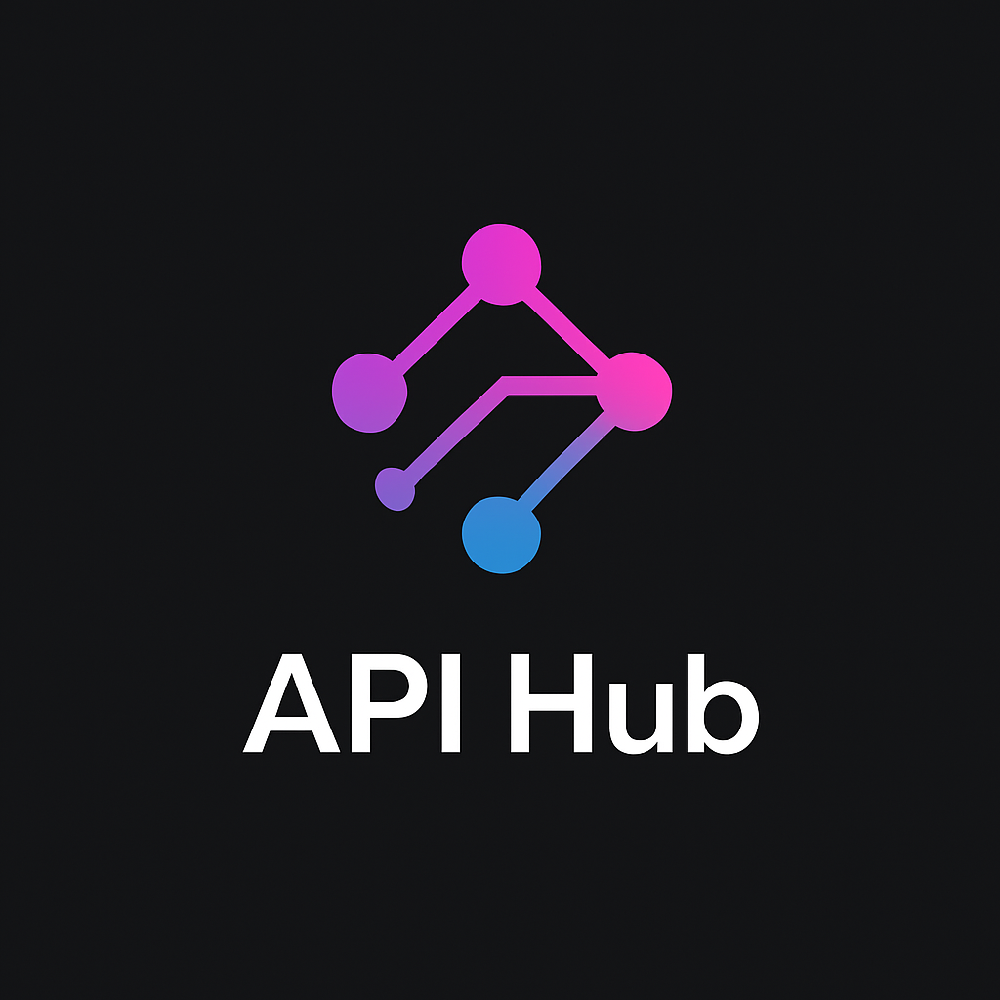

# API Hub - Plugin-Based REST API System



## 📋 Deskripsi

API Hub adalah sistem REST API berbasis plugin yang dibangun dengan Node.js dan Express. Sistem ini memungkinkan pengembang untuk membuat dan mengelola endpoint API secara modular, di mana setiap endpoint didefinisikan sebagai plugin terpisah. Dengan fitur auto-reload dan interface testing yang interaktif, API Hub memberikan pengalaman pengembangan yang modern dan efisien.

## ✨ Fitur Utama

### 🔌 Sistem Plugin Modular
- Setiap endpoint API adalah file plugin terpisah
- Struktur plugin yang sederhana dan konsisten
- Dukungan untuk berbagai kategori plugin (Tools, AI, Downloader, Utils)
- Auto-detection plugin baru dan yang dihapus

### 🔄 Auto-Reload & File Watching
- Deteksi otomatis perubahan file plugin
- Reload plugin tanpa restart server
- Monitoring direktori secara rekursif
- Penanganan penambahan/penghapusan folder dan file

### 🎨 Interface Web Modern
- Tampilan responsif untuk desktop dan mobile
- Dark/Light mode toggle
- Animasi dan transisi yang smooth
- Interactive API testing interface

### 🧪 Built-in API Testing
- Test endpoint langsung dari browser
- Form input dinamis berdasarkan parameter
- Response viewer dengan syntax highlighting
- Copy response functionality

### 📱 Responsive Design
- Mobile-first approach
- Optimized untuk berbagai ukuran layar
- Touch-friendly interface
- Progressive enhancement

## 🚀 Instalasi dan Setup

### Prasyarat
- Node.js (versi 16 atau lebih baru)
- npm atau yarn

### Langkah Instalasi

1. **Clone atau ekstrak proyek**
   ```bash
   cd api-hub-fixed-final
   ```

2. **Install dependencies**
   ```bash
   npm install
   ```

3. **Jalankan server**
   ```bash
   npm start
   ```

4. **Akses aplikasi**
   - Buka browser dan kunjungi: `http://localhost:3000`
   - Server akan berjalan pada port 3000 secara default

## 📁 Struktur Proyek

```
api-hub-fixed-final/
├── index.js                 # Server utama
├── package.json             # Dependencies dan scripts
├── README.md               # Dokumentasi ini
├── plugins/                # Direktori plugin
│   ├── index.js            # Plugin loader system
│   ├── ai/                 # Plugin kategori AI
│   │   ├── deepai-chat.js
│   │   ├── deepai-image.js
│   │   └── text-generator.js
│   ├── downloader/         # Plugin kategori Downloader
│   │   └── url-info.js
│   ├── tools/              # Plugin kategori Tools
│   │   ├── calculator.js
│   │   └── hello.js
│   └── utils/              # Plugin kategori Utils
│       ├── timestamp.js
│       └── uuid.js
├── public/                 # Static files
│   ├── css/
│   │   └── style.css       # Stylesheet utama
│   ├── js/
│   │   └── main.js         # JavaScript frontend
│   └── images/
│       └── api-hub-logo.png
└── views/                  # Template files
    └── home.ejs            # Template halaman utama
```

## 🔌 Membuat Plugin Baru

### Format Plugin Standar

Setiap plugin harus mengikuti format berikut:

```javascript
export default {
  name: "Nama Plugin",
  category: "kategori",
  method: "GET", // atau POST, PUT, DELETE
  path: "/api/endpoint-path",
  description: "Deskripsi plugin",
  params: {
    "parameter1": "string - Deskripsi parameter",
    "parameter2": "number - Deskripsi parameter (required)"
  },
  handler: async (req, res) => {
    try {
      // Logic plugin di sini
      res.json({
        status: "success",
        data: "response data"
      });
    } catch (error) {
      res.status(500).json({
        status: "error",
        message: error.message
      });
    }
  }
};
```

### Contoh Plugin Sederhana

```javascript
// plugins/tools/example.js
export default {
  name: "Example Plugin",
  category: "tools",
  method: "GET",
  path: "/api/example",
  description: "Plugin contoh untuk demonstrasi",
  params: {
    "message": "string - Pesan yang akan dikembalikan"
  },
  handler: async (req, res) => {
    const { message = "Hello World!" } = req.query;
    
    res.json({
      status: "success",
      message: message,
      timestamp: new Date().toISOString()
    });
  }
};
```

### Kategori Plugin yang Tersedia

1. **tools** - Utilitas dan tools umum
2. **ai** - Plugin berbasis AI dan machine learning
3. **downloader** - Plugin untuk download dan fetch data
4. **utils** - Utility functions dan helpers

## 🛠️ Plugin yang Tersedia

### Tools Category

#### 1. Hello Plugin (`/api/hello`)
- **Method**: GET
- **Description**: Plugin sederhana untuk greeting
- **Parameters**: Tidak ada
- **Response**: Pesan hello dengan timestamp

#### 2. Calculator Plugin (`/api/calculate`)
- **Method**: POST
- **Description**: Kalkulator sederhana
- **Parameters**:
  - `operation`: string - Operasi matematika (+, -, *, /)
  - `a`: number - Angka pertama
  - `b`: number - Angka kedua

### AI Category

#### 1. Text Generator (`/api/ai/text-generator`)
- **Method**: POST
- **Description**: Generate text menggunakan AI
- **Parameters**:
  - `prompt`: string - Prompt untuk generate text
  - `max_length`: number - Panjang maksimal text

#### 2. DeepAI Chat (`/api/ai/deepai-chat`)
- **Method**: POST
- **Description**: Chat dengan AI menggunakan DeepAI
- **Parameters**:
  - `message`: string - Pesan untuk AI

#### 3. DeepAI Image (`/api/ai/deepai-image`)
- **Method**: POST
- **Description**: Generate image menggunakan DeepAI
- **Parameters**:
  - `text`: string - Deskripsi image yang ingin dibuat

### Downloader Category

#### 1. URL Info (`/api/downloader/url-info`)
- **Method**: GET
- **Description**: Mendapatkan informasi dari URL
- **Parameters**:
  - `url`: string - URL yang ingin dianalisis

### Utils Category

#### 1. Timestamp (`/api/utils/timestamp`)
- **Method**: GET
- **Description**: Mendapatkan timestamp dalam berbagai format
- **Parameters**: Tidak ada

#### 2. UUID Generator (`/api/utils/uuid`)
- **Method**: GET
- **Description**: Generate UUID
- **Parameters**:
  - `version`: number - Versi UUID (default: 4)

## 🎨 Kustomisasi Interface

### Theme System
- Sistem dark/light mode otomatis
- CSS variables untuk easy customization
- Responsive design dengan breakpoints yang jelas

### Styling
- File CSS utama: `public/css/style.css`
- Menggunakan CSS Grid dan Flexbox
- Animasi dan transisi yang smooth
- Mobile-first responsive design

### JavaScript Frontend
- File utama: `public/js/main.js`
- Class-based architecture
- Event handling untuk API testing
- Theme management
- Dynamic content loading

## 🔧 Konfigurasi

### Environment Variables
```bash
PORT=3000                    # Port server (default: 3000)
NODE_ENV=development         # Environment mode
```

### Server Configuration
Server dikonfigurasi untuk:
- Listen pada `0.0.0.0` untuk akses eksternal
- CORS enabled untuk frontend-backend communication
- JSON dan URL-encoded body parsing
- Static file serving dari direktori `public`

## 📊 Monitoring dan Logging

### Console Logging
- Plugin loading/unloading events
- File watching notifications
- Route registration logs
- Error handling dengan stack traces

### Health Check Endpoint
```
GET /api/health
```
Response:
```json
{
  "status": "healthy",
  "timestamp": "2024-01-01T00:00:00.000Z",
  "uptime": 3600,
  "plugins": 8
}
```

## 🚀 Deployment

### Local Development
```bash
npm start
```

### Production Deployment
1. Set environment variables
2. Install production dependencies
3. Build dan optimize assets
4. Deploy ke platform pilihan (Heroku, Vercel, dll)

### Docker Support
```dockerfile
FROM node:18-alpine
WORKDIR /app
COPY package*.json ./
RUN npm ci --only=production
COPY . .
EXPOSE 3000
CMD ["npm", "start"]
```

## 🔒 Security Considerations

### Input Validation
- Semua input user harus divalidasi
- Sanitize parameter sebelum processing
- Rate limiting untuk mencegah abuse

### Error Handling
- Jangan expose sensitive information
- Log errors untuk debugging
- Return user-friendly error messages

### CORS Configuration
- Configure CORS sesuai kebutuhan
- Whitelist domain yang diizinkan
- Secure headers implementation

## 🧪 Testing

### Manual Testing
- Gunakan built-in API testing interface
- Test semua endpoint secara manual
- Verify response format dan status codes

### Automated Testing
```bash
# Install testing dependencies
npm install --save-dev jest supertest

# Run tests
npm test
```

## 🤝 Contributing

### Guidelines
1. Fork repository
2. Create feature branch
3. Follow coding standards
4. Add tests untuk fitur baru
5. Submit pull request

### Code Style
- Use ES6+ features
- Consistent indentation (2 spaces)
- Meaningful variable names
- Comment complex logic

## 📝 Changelog

### Version 1.0.0
- Initial release
- Plugin system implementation
- Auto-reload functionality
- Web interface dengan API testing
- Responsive design
- Dark/light mode support

### Version 1.1.0 (Current)
- Enhanced file watching system
- Auto-detection untuk plugin baru/dihapus
- Improved mobile responsiveness
- Fixed send request functionality
- Better error handling

## 🐛 Troubleshooting

### Common Issues

#### Plugin tidak ter-load
- Pastikan format plugin sesuai standar
- Check console untuk error messages
- Verify file path dan permissions

#### Server tidak start
- Check port availability
- Verify Node.js version
- Install missing dependencies

#### API request gagal
- Check network connectivity
- Verify endpoint URL
- Check request parameters

### Debug Mode
```bash
DEBUG=* npm start
```

## 📞 Support

Untuk pertanyaan, bug reports, atau feature requests:
- Email: support@apihub.dev
- GitHub Issues: [Repository Issues](https://github.com/apihub/rest-api-plugin-system/issues)
- Documentation: [Wiki](https://github.com/apihub/rest-api-plugin-system/wiki)

## 📄 License

MIT License - see LICENSE file for details

## 🙏 Acknowledgments

- Express.js team untuk framework yang powerful
- Node.js community untuk ecosystem yang luar biasa
- Contributors yang telah membantu pengembangan proyek ini

---

**API Hub** - Modern Plugin-Based REST API System
Built with ❤️ using Node.js and Express

